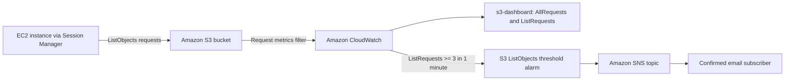

# Day 2 — Monitor Amazon S3 Requests with CloudWatch

## Objective

Configure monitoring for an Amazon S3 bucket, visualize request activity in Amazon CloudWatch, and send an email alert when object-listing requests reach a defined threshold.

## Architecture



## Services used

- **Amazon S3** stores the test objects and emits bucket request metrics.
- **Amazon CloudWatch** displays metrics, dashboard widgets, and alarms.
- **Amazon SNS** sends alarm notifications by email.
- **AWS Systems Manager Session Manager** provides browser-based terminal access to generate test activity.

## Implementation summary

### 1. Configure S3 request metrics

1. Open the provided lab S3 bucket.
2. In **Metrics**, create a request-metrics filter named `ListObjectOperations`.
3. Apply the filter to all objects in the bucket.
4. Upload at least three non-sensitive test files.

This makes filtered request metrics such as `AllRequests` and `ListRequests` available. Metric data can take 15–45 minutes to appear.

### 2. Create a CloudWatch dashboard

Create `s3-dashboard` and add line widgets for `AllRequests` and `ListRequests`, selecting the bucket and `ListObjectOperations` dimensions for each metric.

### 3. Create an alarm and notification

| Setting | Value |
| --- | --- |
| Alarm name | `S3-ListObjects-Threshold-Alarm` |
| Metric | `ListRequests` |
| Statistic | `Sum` |
| Period | `1 minute` |
| Threshold | Greater than or equal to `3` |
| Datapoints to alarm | `1 out of 1` |
| Missing data | Treat as good / not breaching |
| SNS topic | `S3-ListObjects-Alarm-Topic` |

Confirm the SNS email subscription to receive notifications.

### 4. Generate and validate activity

From the lab-provided Session Manager terminal, run the following command after replacing the placeholder with the lab bucket name:

```bash
for i in {1..5}; do aws s3 ls s3://YOUR-LAB-BUCKET-NAME; sleep 2; done
```

The command generates five object-listing operations. Confirm that the alarm changes to `ALARM`, the SNS email arrives, and both dashboard widgets show activity.

## What I learned

- Metrics measure resource activity.
- Dashboards make selected metrics visible in one place.
- Alarms evaluate metrics against a defined condition and change state when it is breached.
- SNS delivers alarm notifications to subscribed recipients.
- Monitoring repeated `ListObjects` calls can help identify unexpected access patterns or excessive automation.

## Evidence to add

Add sanitized screenshots under [`evidence/`](evidence/):

1. S3 request metrics filter configuration
2. `s3-dashboard` showing `AllRequests` and `ListRequests`
3. Alarm in `ALARM` state
4. SNS alarm-notification email with personal information hidden

Do not commit account IDs, temporary lab bucket names, email addresses, access keys, secret keys, or other sensitive information.

## Cleanup

Lab-created resources may be removed automatically after ending the lab. In a personal account, remove unneeded CloudWatch alarms, dashboards, SNS topics/subscriptions, and S3 test objects.
