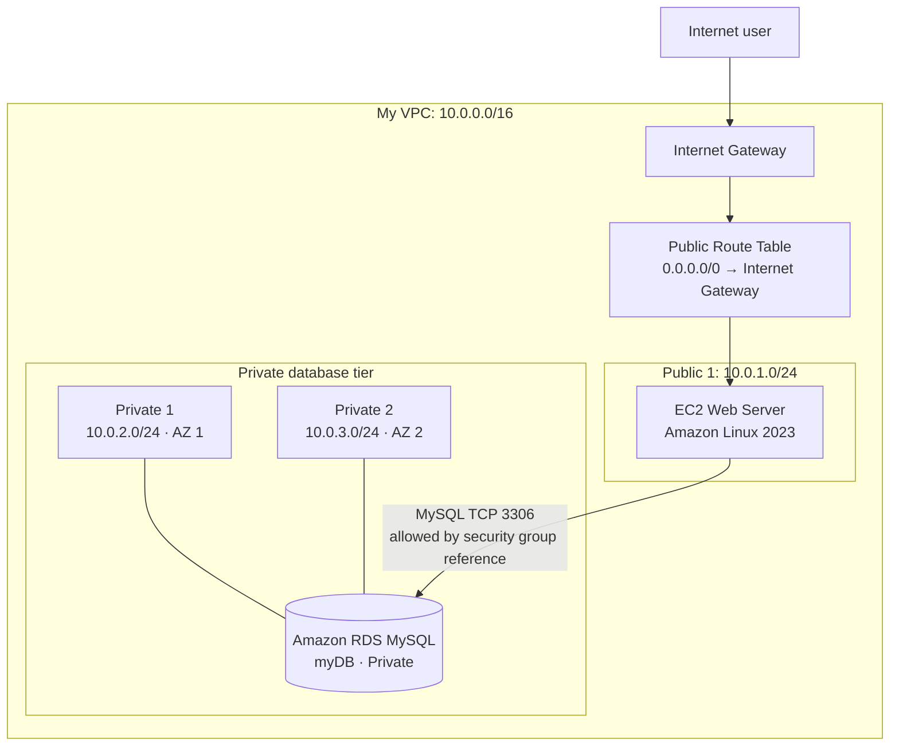

# Day 3 — VPC with an EC2 Web Server and Private RDS Database

## Objective

Build a two-tier application architecture in a custom Amazon VPC. An EC2-hosted address book application accepts HTTP requests from the internet, while an Amazon RDS for MySQL database stays in private subnets and accepts database traffic only from the web server.

## Architecture

## Components

| Component | Configuration | Purpose |
| --- | --- | --- |
| VPC | `My VPC`, `10.0.0.0/16` | Isolated network boundary |
| Public subnet | `Public 1`, `10.0.1.0/24` | Hosts the public web server |
| Private subnets | `Private 1` `10.0.2.0/24`, `Private 2` `10.0.3.0/24` | Supports the RDS DB subnet group across two AZs |
| Internet Gateway | `My IG` | Provides a path between the public subnet and the internet |
| Public Route Table | Default route `0.0.0.0/0` to the Internet Gateway | Makes the associated subnet public |
| EC2 | Amazon Linux 2023, `t3.micro` | Hosts the address book application |
| Amazon RDS | MySQL, `db.t3.micro`, Single-AZ, private access | Stores the application data |

## Implementation summary

### 1. Network foundation

1. Create `My VPC` with CIDR `10.0.0.0/16`.
2. Create `Public 1` in the first Availability Zone with CIDR `10.0.1.0/24`.
3. Enable automatic public IPv4 assignment for `Public 1`.
4. Create and attach the `My IG` Internet Gateway to `My VPC`.
5. Create `Public Route Table`, add `0.0.0.0/0` with `My IG` as target, and associate it with `Public 1`.

### 2. Web tier

1. Create the `Web server` security group in `My VPC`.
2. Allow inbound HTTP (TCP 80) from `0.0.0.0/0` for this public demonstration.
3. Launch an Amazon Linux 2023 `t3.micro` instance named `Web Server` in `Public 1`.
4. Attach the `Web server` security group and use the lab-provided user-data script to install the web application.
5. Wait for the instance status checks to pass, then test the application using `http://<public-ip>`.

### 3. Database tier

1. Create two private subnets in different Availability Zones:
   - `Private 1`: `10.0.2.0/24`
   - `Private 2`: `10.0.3.0/24`
2. Create the `Database` security group.
3. Allow inbound MySQL/Aurora traffic (TCP 3306) **only from the Web server security group**.
4. Create `My Subnet Group` containing both private subnets.
5. Create a private, Single-AZ MySQL RDS instance named `myDB` and attach only the `Database` security group.

### 4. Application-to-database connection

1. Wait until the RDS instance state is `Available`.
2. Copy the RDS endpoint from its **Connectivity & security** details.
3. In the web application, supply the endpoint, database name, and the lab-provided database credentials.
4. Verify that address-book entries can be created and removed.

## Validation checklist

- [ ] `Public 1` is associated with `Public Route Table`.
- [ ] The public route table contains `0.0.0.0/0` pointing to `My IG`.
- [ ] The EC2 web page opens over HTTP using its public IPv4 address.
- [ ] RDS status is `Available` and public access is disabled.
- [ ] RDS uses the private DB subnet group.
- [ ] Database security group permits TCP 3306 from the `Web server` security group ID.
- [ ] The application can read and write address-book data.

## Key design and security decisions

- Assigning a public IPv4 address does not alone make a subnet public; its route table must also have a route to an Internet Gateway.
- The RDS database has no direct internet path. It is reachable only from instances that have the permitted web-server security group.
- Referencing a security group as the source of a database rule is safer and more maintainable than allowing an entire public CIDR range.
- RDS requires a DB subnet group with subnets in at least two Availability Zones, even when using a Single-AZ deployment.
- For production, use HTTPS, a load balancer, private application subnets, Multi-AZ RDS, automated backups, Secrets Manager, and least-privilege IAM roles.

## Troubleshooting

| Symptom | Likely check |
| --- | --- |
| EC2 page does not load | Instance is running, status checks pass, public IPv4 is used with `http://`, and inbound HTTP 80 is allowed. |
| Application shows Gateway Timeout | RDS is `Available`; database security group allows TCP 3306 from the **Web server security group ID**; endpoint and credentials are correct. |
| RDS cannot be created | Confirm the DB subnet group contains the two private subnets in separate Availability Zones. |

## Cleanup

In a personal AWS account, delete resources in this order to avoid unwanted cost: RDS instance, EC2 instance, DB subnet group, security groups, route table, Internet Gateway, subnets, and VPC. Lab-managed resources may be removed automatically after ending the lab.

## Evidence to add

Add sanitized screenshots under [`evidence/`](evidence/):

1. VPC resource map or subnet configuration
2. EC2 application page
3. RDS connectivity/security configuration with sensitive details hidden
4. Working address-book page after connecting to RDS

Never commit database passwords, private endpoints, account IDs, or personally identifiable information.
